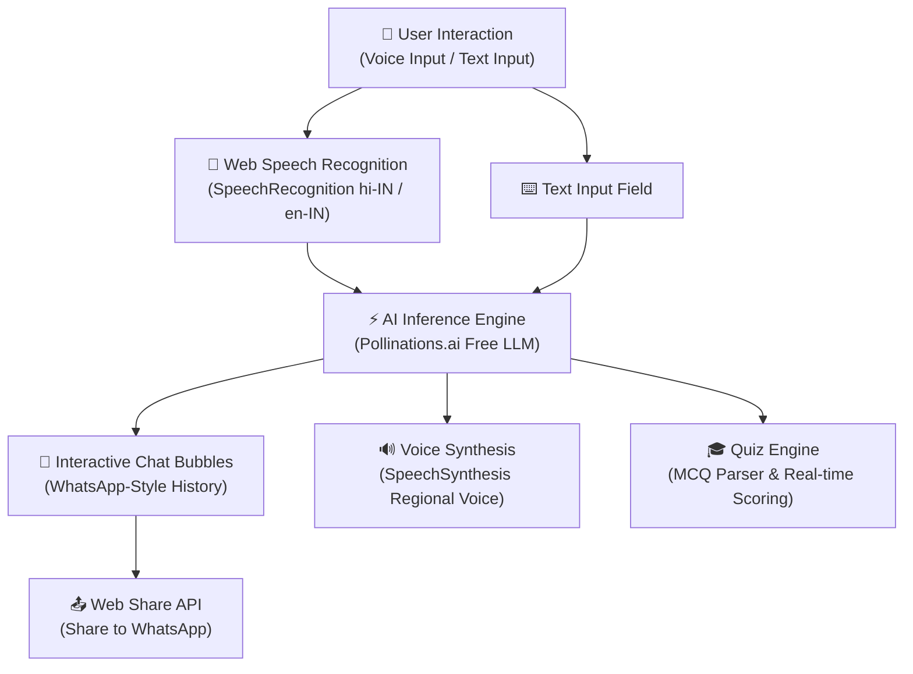

# 🎙️ MANAS AI — Mewari IT Guru
### *Empowering Rural Rajasthan with Vernacular AI-Driven IT Mentorship*

[](https://divyarajsingh2021-pixel.github.io/Manas-Ai/)
[](https://gdg.community.dev/events/details/google-gdg-cloud-udaipur-presents-lakecity-hackathon-2026/)
[](#-tech-stack--technologies)
[](#-how-it-works)
[](#-progressive-web-app-pwa)
[](http://makeapullrequest.com)

---

## 📌 Problem Statement & Vision

While technology and Artificial Intelligence are advancing at lightning speed, students in rural regions like Rajasthan often face a critical hurdle: **the technical English language barrier**. Complex computing concepts—such as CPU architecture, RAM, networking, algorithms, and cloud systems—can feel alien when presented exclusively in English.

**MANAS AI** bridges this digital divide. Serving as an accessible, voice-first **Mewari IT Mentor (Guru)**, MANAS AI translates and explains intricate IT & computer science fundamentals into natural, conversational **Mewari, Hindi, Bhojpuri, Gujarati, and English**, meeting rural students in the language they speak at home.

---

## ✨ Key Features & Capabilities

- 🗣️ **Two-Way Voice Interaction**: Speech-to-Text (`SpeechRecognition`) & Text-to-Speech (`SpeechSynthesis`) designed for hands-free and accessible learning.
- 💬 **Text Input Mode**: Seamlessly switch between voice queries and keyboard input.
- 🎓 **Interactive Gamified Quiz Mode**: Auto-generates multiple-choice IT questions with real-time scoring, answer validation, and audio explanations.
- 🏰 **Hyper-Local Language Mentorship**: 5 regional language modes (Mewari, Hindi, Bhojpuri, Gujarati, and English).
- 💡 **One-Tap Suggested Question Chips**: Contextual quick-prompts to spark curiosity about RAM, CPU, Internet, and Cyber Safety.
- 🧠 **Animated AI Mascot**: Dynamic visual reactions reflecting AI state (Listening, Thinking, Speaking, Idle).
- 🌗 **Dark / Light Mode**: Instant eye-friendly theme switching with persistent local storage.
- 📤 **Web Share API**: Share key IT learnings and explanations directly to WhatsApp or family in one click.
- 📱 **Progressive Web App (PWA)**: Installable directly on Android, iOS, or PC as a lightweight app with offline resilience.
- 🆓 **100% Free & Serverless**: Zero paid API keys, zero backend servers, runs purely on the browser.

---

## 🔄 System Architecture & Flow



---

## 🛠️ Tech Stack & Technologies

| Layer | Technology | Purpose |
| :--- | :--- | :--- |
| **Frontend** | HTML5, Modern CSS3 (Variables & Glassmorphism), ES6+ JS | Dependency-free, lightning-fast UI |
| **Typography** | [Google Fonts (Outfit)](https://fonts.google.com/specimen/Outfit) | Clean, accessible modern typography |
| **Speech-to-Text** | Web Speech API (`webkitSpeechRecognition`) | Real-time voice transcription (`hi-IN`, `gu-IN`, `en-IN`) |
| **Speech Synthesis** | Web SpeechSynthesis API | Natural voice audio responses with auto voice selector |
| **AI Backend** | Pollinations.ai (Free LLM Endpoint) | Real-time contextual IT mentorship without API keys |
| **Offline & PWA** | Service Worker (`sw.js`) & `manifest.json` | Installable mobile web app with offline cache |
| **Hosting** | GitHub Pages | Zero-cost continuous deployment |

---

## 📂 Project Structure

```text
Manas-Ai/
├── index.html        # Unified Single-Page Application (UI, Audio & Logic)
├── manifest.json     # PWA Configuration & Icon Manifest
├── sw.js             # Service Worker for Offline Caching
└── README.md         # Comprehensive Project Documentation
```

---

## 🚀 Getting Started

### Prerequisites
- A modern Chromium-based web browser (**Google Chrome**, **Microsoft Edge**, **Brave**) with microphone permissions enabled.

### Option 1: Live Demo (Instant)
Experience MANAS AI directly in your browser:  
👉 **[Open Live Demo on GitHub Pages](https://divyarajsingh2021-pixel.github.io/Manas-Ai/)**

### Option 2: Run Locally
1. **Clone the repository:**
   ```bash
   git clone https://github.com/divyarajsingh2021-pixel/Manas-Ai.git
   cd Manas-Ai
   ```

2. **Open the application:**
   - Double-click `index.html` to open it in Google Chrome, or
   - Run a local server:
     ```bash
     # Python
     python -m http.server 8000

     # Node.js
     npx serve .
     ```
3. Open `http://localhost:8000` in Google Chrome and grant microphone permissions when prompted.

---

## 💡 Example Queries to Ask MANAS AI

- *"RAM और Hard Disk में क्या अंतर है?"* (What is the difference between RAM and Hard Disk?)
- *"Computer CPU कियां काम करे सा?"* (How does the CPU work in Mewari?)
- *"Internet कैसे काम करता है?"* (How does the Internet work?)
- *"कोडिंग सीखना क्यों ज़रूरी है?"* (Why is learning to code important?)
- *"Virus सूं कंप्यूटर ने कियां बचावणो?"* (How to protect a computer from viruses?)

---

## 🏆 Hackathon Context

Built with ❤️ for **[Lakecity Hackathon 2026](https://gdg.community.dev/events/details/google-gdg-cloud-udaipur-presents-lakecity-hackathon-2026/)** presented by **GDG Cloud Udaipur**.

---

## 👨‍💻 Author & Contributions

- **Divyaraj Singh** — [@divyarajsingh2021-pixel](https://github.com/divyarajsingh2021-pixel)
- 📺 **Video Demonstration:** [Watch on YouTube](https://youtu.be/X47CrhWFIJA)

Pull requests, feature suggestions, and feedback are always welcome! ⭐
