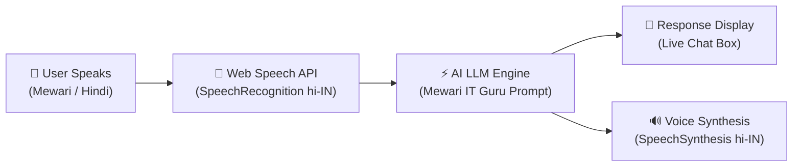

# 🎙️ MANAS AI — Mewari IT Guru
### *Empowering Rural Rajasthan with Vernacular AI-Driven IT Mentorship*

[](https://divyarajsingh2021-pixel.github.io/Manas-Ai/)
[](https://gdg.community.dev/events/details/google-gdg-cloud-udaipur-presents-lakecity-hackathon-2026/)
[](#-tech-stack)
[](#-how-it-works)

---

## 📌 Problem Statement & Vision

While technology and Artificial Intelligence are advancing at lightning speed, students in rural regions like Rajasthan often face a critical hurdle: **the technical English language barrier**. Complex computing concepts—such as CPU architecture, RAM, networking, algorithms, and cloud systems—can feel alien when presented exclusively in English.

**MANAS AI** bridges this digital divide. Serving as an accessible, voice-first **Mewari IT Mentor (Guru)**, MANAS AI translates and explains intricate IT & computer science fundamentals into natural, conversational **Mewari & Hindi**, meeting rural students in the language they speak at home.

---

## ✨ Key Features

- 🗣️ **Voice-First Conversational Interface**: Full two-way voice interaction (Speech-to-Text & Text-to-Speech) designed for intuitive, hands-free learning.
- 🏰 **Hyper-Local Language Mentorship**: Tailored prompting delivers responses in the regional Mewari dialect and Hindi script.
- ⚡ **Zero-Install, Lightweight Web App**: Runs directly on mobile and desktop browsers with no bulky installations or setup friction.
- 🎨 **Modern Futuristic UI**: Clean dark-mode glassmorphic interface with interactive pulsing audio indicators and real-time status feedback.
- 📱 **Mobile-First & Low Latency**: Fast, responsive performance optimized for bandwidth-constrained rural environments.

---

## 🔄 System Architecture & Flow



1. **Audio Capture & STT**: The user presses the microphone button, activating the Web Speech Recognition engine (`hi-IN`).
2. **AI Inference & Dialect Translation**: The transcript is dispatched with a specialized IT mentor system prompt to generate concise explanations in Mewari/Hindi.
3. **Multimodal Output**: The response renders in real-time inside the chat interface and is concurrently spoken back via speech synthesis.

---

## 🛠️ Tech Stack & Technologies

| Layer | Technology | Purpose |
| :--- | :--- | :--- |
| **Frontend** | HTML5, Modern CSS3, JavaScript (ES6+) | Lightweight, dependency-free responsive client |
| **Typography** | [Google Fonts (Outfit)](https://fonts.google.com/specimen/Outfit) | Clean, accessible modern typography |
| **Speech-to-Text** | Google Web Speech Recognition API (`webkitSpeechRecognition`) | Real-time voice query transcription (`hi-IN`) |
| **Speech-to-Voice** | Web SpeechSynthesis API | Natural voice audio playback (`hi-IN`) |
| **AI Backend** | Generative LLM API (Inference Engine) | Fast conversational contextual IT responses |
| **Hosting** | GitHub Pages | High-availability global deployment |

---

## 📂 Project Structure

```text
Manas-Ai/
├── index.html      # Complete Single-Page Application (UI, Styling & AI Logic)
└── README.md       # Project Documentation & Architecture Guide
```

---

## 🚀 Getting Started

### Prerequisites
- A modern Chromium-based web browser (e.g., **Google Chrome**, **Microsoft Edge**, **Brave**) with microphone permissions enabled for the Web Speech API.

### Option 1: Live Demo (Instant)
Experience MANAS AI directly in your browser:
👉 **[Open Live Demo on GitHub Pages](https://divyarajsingh2021-pixel.github.io/Manas-Ai/)**

### Option 2: Run Locally
1. **Clone the repository:**
   ```bash
   git clone https://github.com/divyarajsingh2021-pixel/Manas-Ai.git
   cd Manas-Ai
   ```

2. **Open the application:**
   - Simply double-click `index.html` to open it in your browser, or
   - Serve using any local server:
     ```bash
     # Using Python
     python -m http.server 8000

     # Using Node.js npx
     npx serve .
     ```
3. Open `http://localhost:8000` in Google Chrome and allow microphone access.

---

## 💡 Example Queries to Ask MANAS AI

- *"RAM aur Hard Disk mein kya farak hove hai?"* (What is the difference between RAM and Hard Disk?)
- *"Computer CPU kaise kaam kare hai?"* (How does the CPU work?)
- *"Internet kya hove hai sa?"* (What is the Internet?)
- *"Coding sikhna kyu zaroori hai?"* (Why is it important to learn coding?)

---

## 🔮 Roadmap & Future Enhancements

- [ ] **Gemini Multimodal Live API**: Direct real-time audio streaming for sub-second conversational latency.
- [ ] **Expanded Mewari Dialect Dataset**: Fine-tuned vernacular terminology for advanced computer science topics.
- [ ] **Progressive Web App (PWA)**: Full offline-first caching for areas with unstable internet connectivity.
- [ ] **Interactive Visual Cards**: Displaying diagrams and animated hardware breakdowns alongside voice responses.
- [ ] **Gamified Quizzes**: Bite-sized IT concept quizzes with spoken scorecards.

---

## 🏆 Hackathon Context

Built with ❤️ for **[Lakecity Hackathon 2026](https://gdg.community.dev/events/details/google-gdg-cloud-udaipur-presents-lakecity-hackathon-2026/)** presented by **GDG Cloud Udaipur**.

---

## 👨‍💻 Author & Contributions

- **Divyaraj Singh** — [@divyarajsingh2021-pixel](https://github.com/divyarajsingh2021-pixel)
- 📺 **Video Demonstration:** [Watch on YouTube](https://youtu.be/X47CrhWFIJA)

Contributions, issues, and feature requests are welcome! Give a ⭐️ if you find this project impactful!
